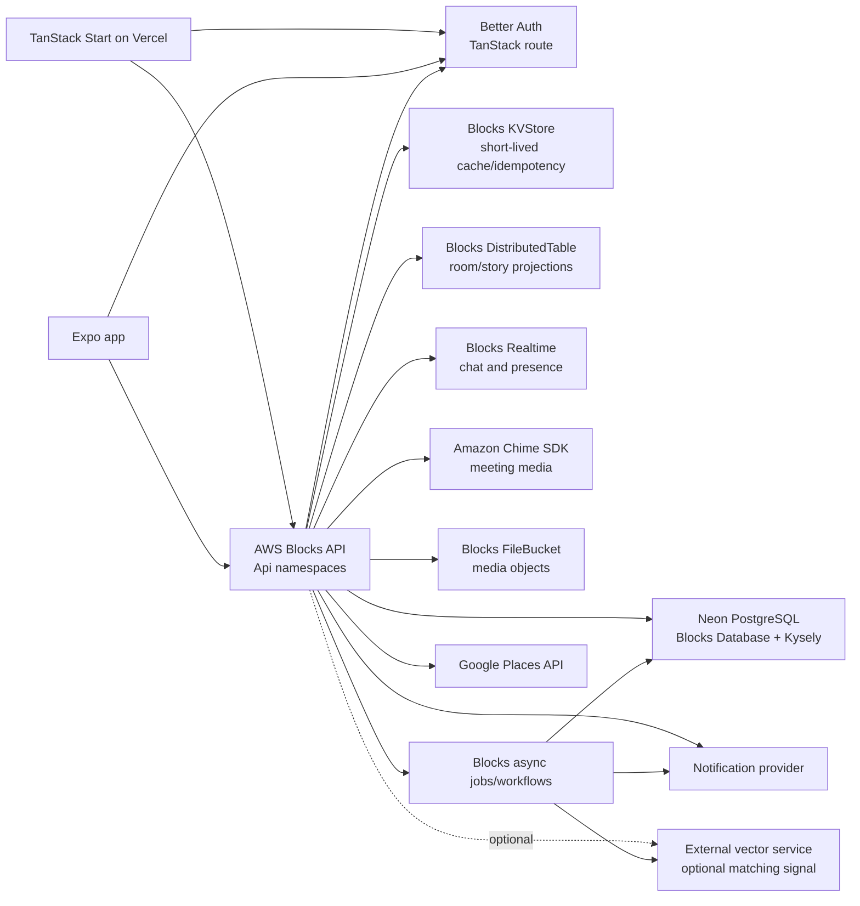
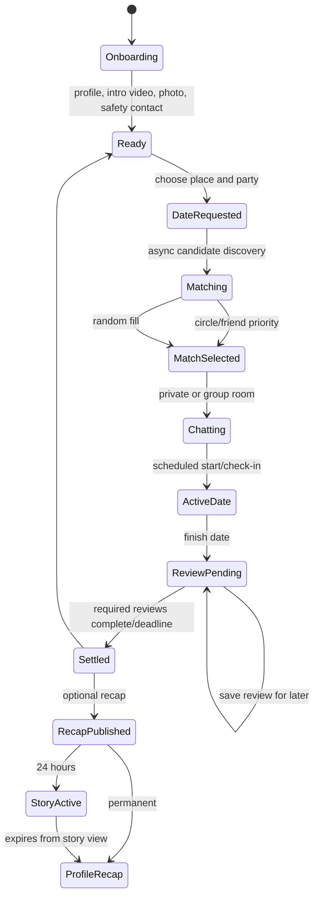

# Chewbuu Architecture

This is the target architecture for the AWS Blocks migration. Better Auth remains the identity authority; AWS Blocks owns the authenticated product API and durable domain workflows.

## Product Lifecycle

## Relationship and Media Rules

- Friends are accepted one-to-one relationships with a private chat.
- Circles are accepted premium memberships with an automatically-created group chat.
- A group date has up to four participants per side and stores each participant's source and status.
- Solo dates use private chat; any multi-person date uses a Chime meeting.
- Date media is durable and can be attached to a user's review.
- Reviews may remain incomplete, but any pending required review blocks new date creation.
- Recaps are permanent profile content; story visibility is controlled by `story_expires_at`.
- KVStore is for short-lived cache/idempotency only. PostgreSQL is authoritative for product state.
